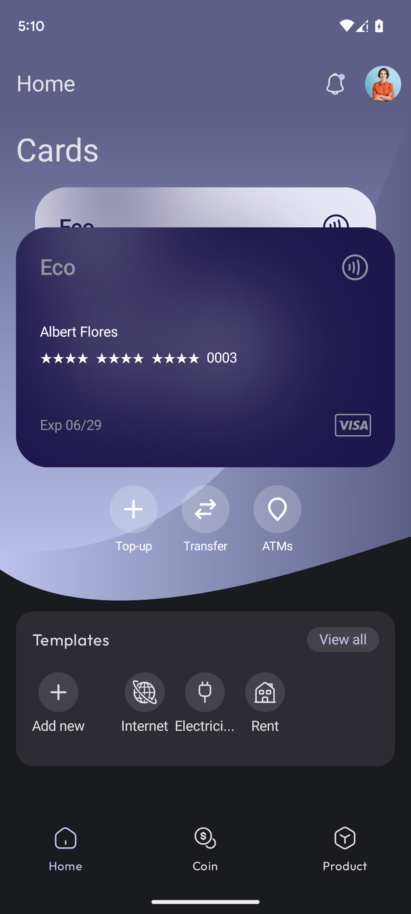
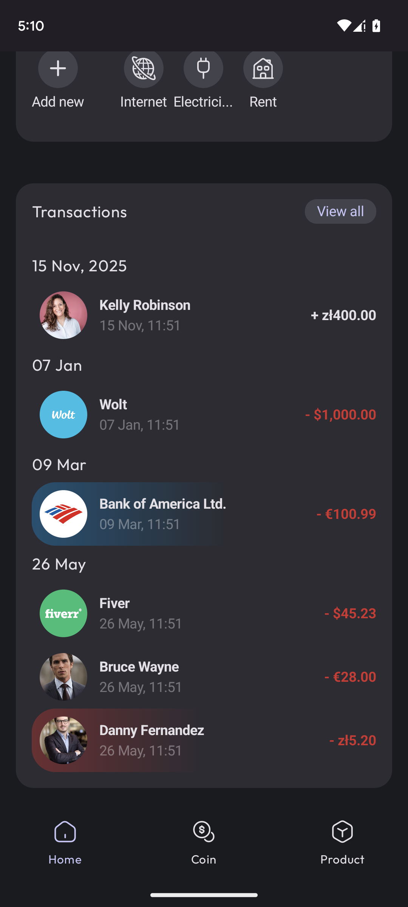
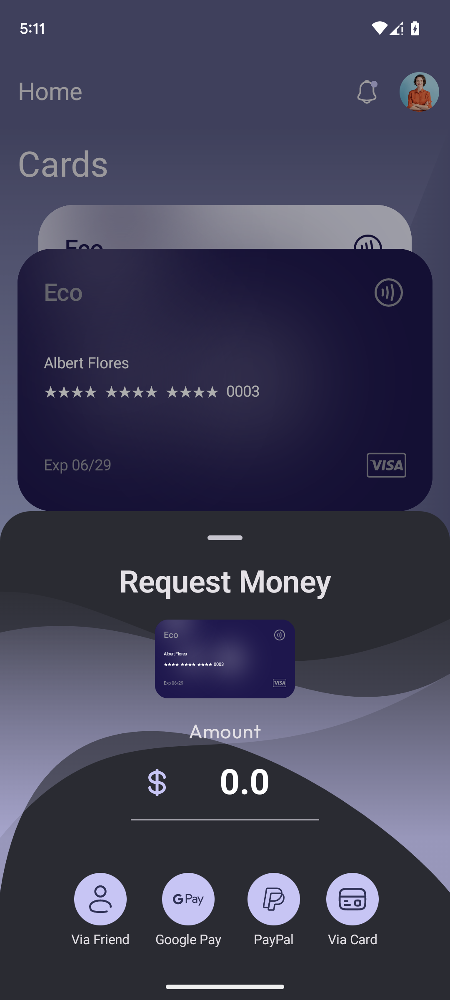
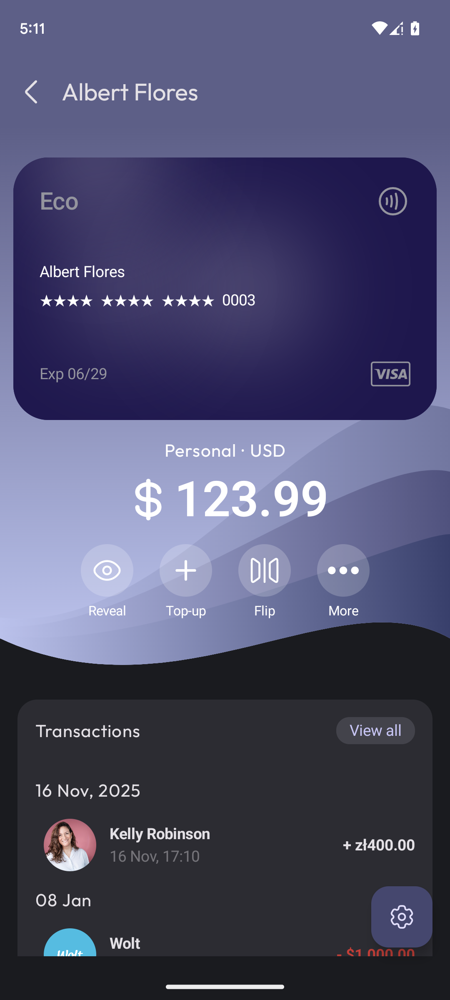
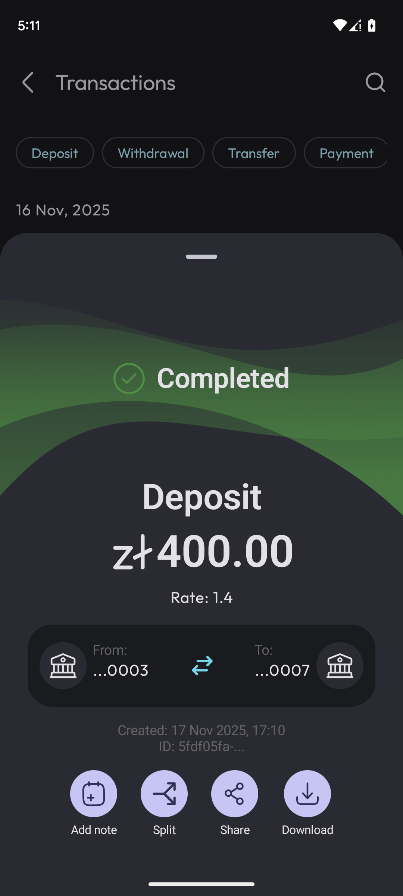
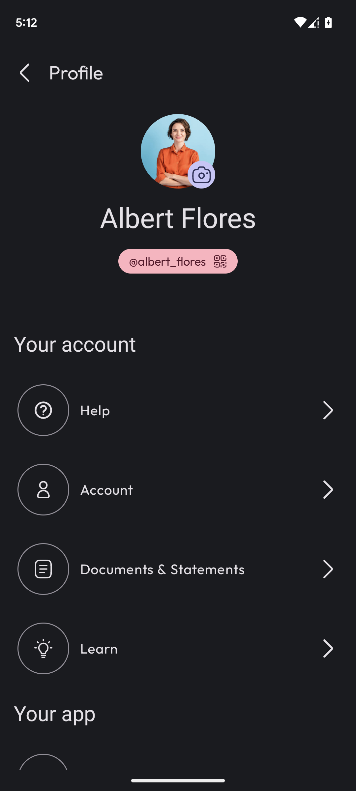
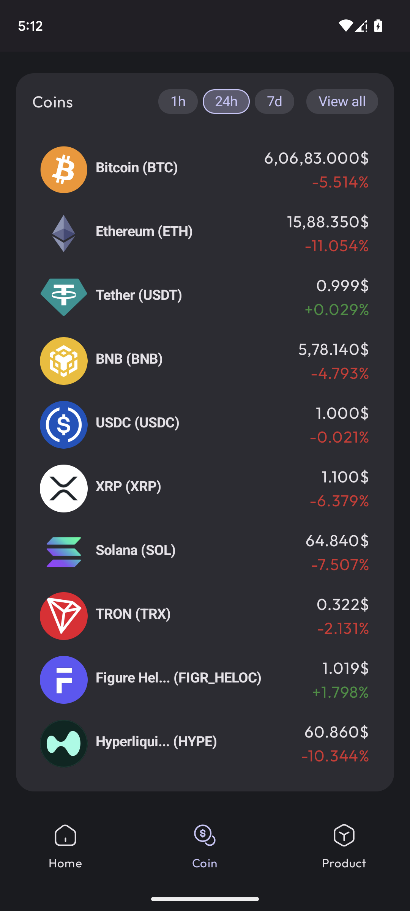
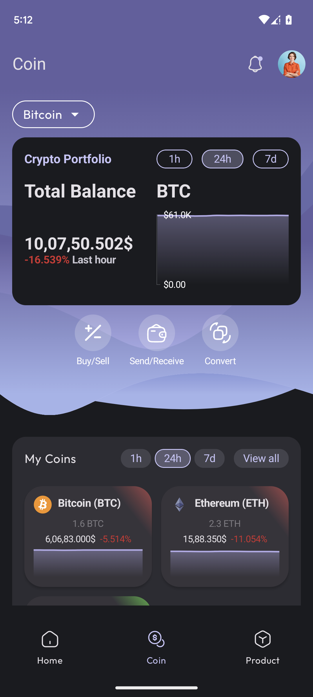

# 💳 ECO - BankingApp - Android UI Showcase

> ⚠️ **Disclaimer:** This application is a **purely visual prototype** built for portfolio and demonstration purposes only. It does **not** implement real banking functionality, security standards, authentication protocols, or data handling. It should **not** be used as a reference or starting point for any real-world financial application. All data shown is fictional.

---

## 📱 Overview

A modern Android banking application UI concept, designed to demonstrate clean material design principles, smooth navigation flows, and contemporary mobile UX patterns. Built entirely as a front-end visual showcase.

---

## 🖼️ Screenshots

<table>
  <tr>
    <td align="center">
       
      <b>Cards/Main</b>
    </td>
    <td align="center">
       
      <b>Transactions</b>
    </td>
    <td align="center">
       
      <b>Money Request</b>
    </td>
    <td align="center">
       
      <b>Account/Card Details</b>
    </td>
  </tr>
  <tr>
    <td align="center">
       
      <b>Transaction Details</b>
    </td>
    <td align="center">
       
      <b>Profile</b>
    </td>
    <td align="center">
       
      <b>Crypto Coins</b>
    </td>
    <td align="center">
       
      <b>Crypto Coins Overview</b>
    </td>
  </tr>
</table>

> 📁 All screenshots are located in the [`assets/`](./assets) folder.

---

## 🌐 API Integrations

Despite being a visual prototype, the app integrates two free public APIs to demonstrate real data fetching:

### 📈 CoinGecko API
- **Purpose:** Fetches live cryptocurrency prices and market data
- **Docs:** [https://www.coingecko.com/en/api](https://www.coingecko.com/en/api)
- **Usage in app:** Displays crypto asset values on the dashboard/portfolio screen
- **Auth:** No API key required for free tier

### 🏦 Bank Account Origin Lookup
- **Purpose:** Identifies the country and bank of origin from the first 8 digits of a bank account number (BIN/IIN lookup)
- **Usage in app:** Shown on the transfer screen - entering an account number surfaces the issuing bank name and country flag
- **Note:** Only the first 8 digits are used; no full account data is ever stored or transmitted

> These integrations are used **solely for UI demonstration**. No user data is collected, stored, or processed in any meaningful way.

---

## ✨ UI Features Showcased

- Home dashboard with account balance cards
- Crypto coin features that shows historical data, charts and so on
- Transaction history list with categorization
- Fund transfer & payment UI with bank origin detection
- Card management screen
- Profile and settings panel
- Bottom navigation and drawer patterns

---

## ⚠️ Important Notes

- **No real data** - all account numbers, balances, and names are fictional placeholders.
- **No security** - this app does not implement encryption, biometric auth, or certificate pinning. **Do not treat this as a secure implementation.**
- **Not production-ready** — this is a UI/UX portfolio piece only. The API integrations are for visual effect and demo purposes.

---

## 📄 License

This project is open for portfolio viewing and educational inspiration. Please do not redistribute as your own work.

---

Made with ❤️ for Android UI exploration

